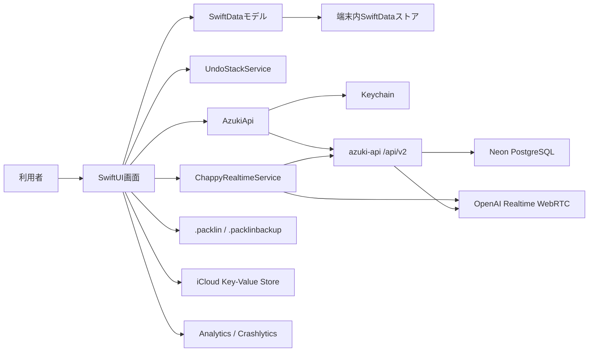
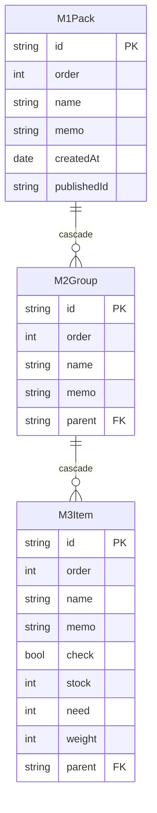
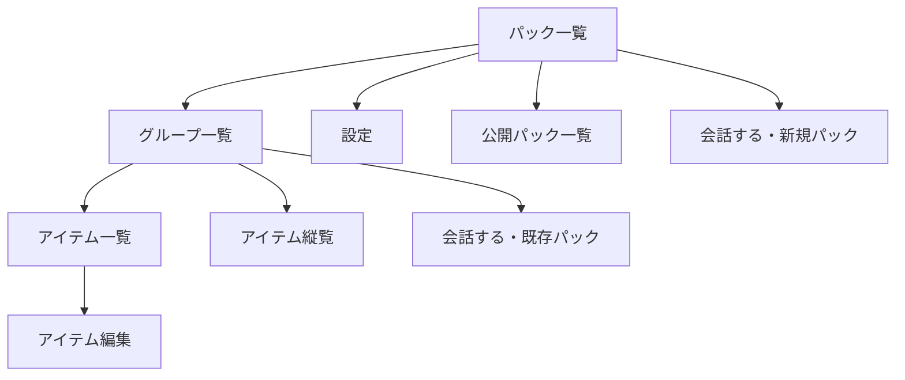
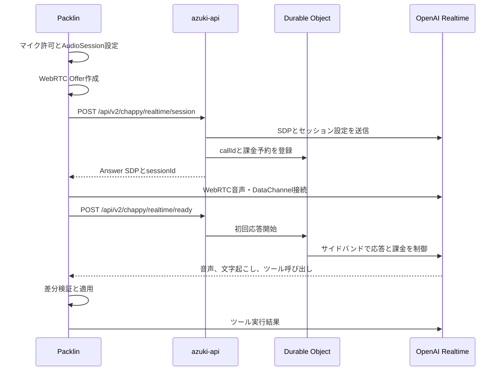

# Packlin 詳細設計

本書は、iOSアプリ「モチメモ Packlin」の現行実装を基準とした詳細設計書である。機能追加や不具合修正では、画面上の挙動だけでなく、本書に記載したデータ不変条件、互換性、障害時動作を維持する。

サーバー側の詳細は[`../azuki-api/DESIGN.md`](../azuki-api/DESIGN.md)を参照する。

## 目次

1. [目的と設計方針](#1-目的と設計方針)
2. [システム構成](#2-システム構成)
3. [動作環境と依存関係](#3-動作環境と依存関係)
4. [ソース構成と責務](#4-ソース構成と責務)
5. [アプリ起動と共通状態](#5-アプリ起動と共通状態)
6. [ドメインモデル](#6-ドメインモデル)
7. [保存・移行・復旧](#7-保存移行復旧)
8. [画面構成とナビゲーション](#8-画面構成とナビゲーション)
9. [編集・並べ替え・Undo](#9-編集並べ替えundo)
10. [ファイル共有と取り込み](#10-ファイル共有と取り込み)
11. [公開パック](#11-公開パック)
12. [チャッピーAI](#12-チャッピーai)
13. [azuki-api通信](#13-azuki-api通信)
14. [認証・クレジット・課金](#14-認証クレジット課金)
15. [設定・多言語・アクセシビリティ](#15-設定多言語アクセシビリティ)
16. [Analytics・ログ・プライバシー](#16-analyticsログプライバシー)
17. [エラー処理と復旧方針](#17-エラー処理と復旧方針)
18. [テスト方針](#18-テスト方針)
19. [API互換性とリリース順序](#19-api互換性とリリース順序)
20. [変更時の確認事項](#20-変更時の確認事項)

## 1. 目的と設計方針

Packlinは、旅行や日常用途の持ち物を「パック」「グループ」「アイテム」の3階層で管理するアプリである。

主要な設計方針は次のとおり。

- 持ち物データは端末内のSwiftDataを正とし、通常操作にサーバー接続を要求しない
- 変更は逐次保存可能なモデルとして管理し、アプリ終了や通信障害で失われにくくする
- パック、グループ、アイテムの順序は配列位置ではなく`order`を唯一の真実源とする
- 外部ファイル、公開パック、AI応答は信頼せず、検証とサニタイズ後に保存する
- AIはデータを直接保持せず、現在パックと会話履歴を都度渡し、差分命令だけを適用する
- 認証情報やクレジット情報は通常の設定値と分離し、Keychainとサーバーを用途別に使用する
- 配信済みアプリを壊さないため、APIメジャーバージョンを明示して段階移行する

## 2. システム構成

通常の持ち物編集は端末内で完結する。azuki-apiは次の機能に限定して使用する。

- AIパック生成と会話
- AIクレジット残高確認と精算
- StoreKit購入検証
- 端末認証とトークン更新
- 公開パックの公開、検索、取り込み、公開取消
- 作者ニックネーム管理

## 3. 動作環境と依存関係

### 3.1 対象環境

| 項目 | 設定 |
|---|---|
| 対象OS | iOS 18.0以降 |
| UI | SwiftUI |
| 永続化 | SwiftData |
| 対応端末 | iPhone、iPhone Simulator |
| Bundle ID | `com.azukid.AzPackList5` |
| Universal Link | `applinks:azuki-api.azukid.com` |

### 3.2 主な依存関係

| 依存 | 用途 |
|---|---|
| AZDial | 数量・重量のダイアル入力 |
| Firebase Analytics | 匿名利用状況の集計 |
| Firebase Crashlytics | クラッシュと非致命的エラーの収集 |
| Google Mobile Ads | バナー・リワード広告表示 |
| WebRTC | OpenAI Realtimeとの直接音声接続 |
| StoreKit 2 | AIクレジット購入 |

XcodeGenは使用せず、`Packlin.xcodeproj`を正としてXcodeで管理する。

## 4. ソース構成と責務

| ディレクトリ | 責務 |
|---|---|
| `PackList/App` | アプリ起点、ナビゲーション、環境別設定、DB初期化と復旧 |
| `PackList/Model` | SwiftDataモデル、DTO、取り込み、API、認証、AI音声、Undo |
| `PackList/View` | 一覧、編集、設定、公開パック、AI、広告、課金画面 |
| `PackList/Common` | Keychain、iCloud、通知、ログ、Analyticsなどの共通処理 |
| `PackList/Extension` | View、文字列、数値、Undo連携などの小規模拡張 |
| `PackList/Resources` | ローカライズ、サンプルパック、アセット、Privacy Manifest |
| `PackListTests` | モデル整合性、順序、Undo、JSON、取り込みの単体テスト |
| `PackListUITests` | 主要画面操作のUIテスト |

大きなViewは画面状態とユーザー操作の調停を担当する。永続化、通信、検証の本体はModelまたはServiceへ置き、View内で同じ業務規則を重複実装しない。

## 5. アプリ起動と共通状態

### 5.1 起動処理

`AppMain`は次の順序で初期化する。

1. `CreditStore`を生成し、KeychainまたはiCloudから`userId`を確定
2. `M1Pack`、`M2Group`、`M3Item`を含むSwiftData `ModelContainer`を生成
3. Firebaseを許可された実行環境で初期化
4. 旧Core DataデータがあればV3 SwiftDataへ移行
5. パックが空ならローカライズ済みサンプルパックを読み込み
6. AdMobを初期化
7. `NavigationStack`へ共通Environment Objectを注入

ModelContainer初期化に失敗した場合は通常画面を開かず、`DatabaseErrorView`からストア退避と復旧を案内する。

### 5.2 共通状態

| 状態 | 型 | 役割 |
|---|---|---|
| ナビゲーション | `NavigationStore` | `NavigationPath`と一覧復帰時のスクロール対象を保持 |
| クレジット | `CreditStore` | `userId`、端末表示残高、Keychain同期を管理 |
| 編集履歴 | `UndoStackService` | SwiftData全体の操作単位Undo/Redoを管理 |
| 外観 | `AppearanceMode` | 自動、ライト、ダークを切り替え |
| 文字サイズ | `FontScale` | システム追従または固定Dynamic Typeを適用 |
| 追加位置 | `InsertionPosition` | 新規要素を先頭または末尾へ追加 |

バックグラウンド遷移時は`ModelContext.hasChanges`を確認して保存する。保存失敗はデータを破棄せず、Analyticsとログへ記録する。

## 6. ドメインモデル

### 6.1 関係

### 6.2 M1Pack

パックはアプリ内の最上位単位である。

- `id`は短縮UUIDによる一意な内部識別子
- `order`は一覧表示順
- `name`と`memo`は利用者入力
- `createdAt`は作成日時または取り込み元日時
- `publishedId`はazuki-api上の公開パックID。`nil`なら未公開
- `child`は配下グループ。削除時はcascadeで配下も削除
- 在庫数、必要数、在庫重量、必要重量は子要素から動的集計

### 6.3 M2Group

グループはパック内の分類単位である。

- `parent`は所属パック
- `child`は配下アイテム。削除時はcascadeで配下も削除
- 集計値はアイテムの`stock`、`need`、`weight`から算出
- `SwiftUI.Group`との名前衝突を避けるため型名を`M2Group`とする

### 6.4 M3Item

アイテムは数量と重量を持つ最小単位である。

- `check`は数量に依存しない明示的チェック状態
- `stock`は現在用意できている数
- `need`は必要数
- `weight`は1個あたりのグラム重量
- 在庫重量は`weight * stock`
- 必要重量は`weight * need`

### 6.5 不変条件

- すべてのモデルIDはモデル種別内で一意
- 端末内パックは最大30件
- グループはパックごとに最大30件、アイテムはグループごとに最大100件
- `name`と`memo`は保存前に規定長へ制限
- `stock`、`need`、`weight`は0以上かつアプリ定数以下
- 子要素の表示順は`order`昇順、同値時は`id`で安定化
- `child`配列の内部順序を表示順として使用しない
- 親削除時に孤立した子要素を残さない
- 外部入力のIDを新規取り込み時の内部IDとして信用しない

## 7. 保存・移行・復旧

### 7.1 SwiftData保存

端末内データはSwiftDataの永続ストアへ保存する。主要操作は同一の`ModelContext`で実行し、ViewとUndoサービスが同じ状態を参照する。

リレーション配列を削除しながら走査する場合は、必ず`Array(...)`でスナップショット化する。SwiftDataが削除に伴ってリレーションキャッシュを更新しても、反復対象を変動させないためである。

### 7.2 V2からV3への移行

`MigratingFromV2toV3`が旧Core Dataデータを検出してSwiftDataへ移す。移行処理は再実行されても重複しないことを前提とし、移行済み判定を保持する。

### 7.3 DB初期化失敗

- エラー画面を表示して通常操作を禁止
- 元ストアを削除せず、復旧用名称へ変更
- 新規ストア生成を可能にする
- 初期化失敗内容をCrashlyticsまたはAnalyticsへ送信

## 8. 画面構成とナビゲーション

### 8.1 主要画面

### 8.2 AppDestination

`NavigationStore.path`には次の値だけを格納する。

- `groupList(packID:)`
- `itemList(packID:groupID:)`
- `itemEdit(packID:groupID:itemID:sort:)`
- `itemSortList(packID:sort:)`

画面遷移ではモデルインスタンスを保持せずIDを渡し、遷移先の`@Query`で現在のモデルを再解決する。削除やUndoで対象が消えた場合は安全な空状態を表示する。

### 8.3 一覧共通仕様

- セル全体を主要遷移のタップ領域とする
- 末尾に追加専用セルは並べ替え対象外
- 追加位置設定にかかわらず、末尾追加セルからは末尾へ追加
- 初心者表示では説明ラベル、達人表示では簡潔なアイコン中心表示
- 一覧のシェブロン位置は固定し、内容側に最低4ptの間隔を確保
- Dynamic Typeで文字が拡大しても、固定要素同士が重ならないレイアウトにする

## 9. 編集・並べ替え・Undo

### 9.1 スパース順序

`order`は原則として1000間隔で採番する。挿入時は前後要素の中間値を使用し、毎回全件更新することを避ける。

- 先頭追加は先頭値から1000を減算
- 末尾追加は末尾値へ1000を加算
- 中間追加は前後値の中間
- 間隔が1以下、または整数オーバーフローが起きる場合は全件再正規化

### 9.2 Undo/Redo

`UndoStackService`はパック全体のスナップショットを操作前後で取得し、差分がある場合だけ履歴へ追加する。

- 既定の最大履歴数は10
- ネストした操作は`transactionDepth`で1操作へまとめる
- Undo/Redo復元中は新しい履歴を記録しない
- 復元時はIDを保ってモデル全体を再構成
- スナップショット取得失敗時は操作を妨げず、その履歴だけを記録しない

AI差分の適用も1回の履歴操作として囲み、利用者が通常のUndoで戻せるようにする。

## 10. ファイル共有と取り込み

### 10.1 形式

| 形式 | 用途 | ID |
|---|---|---|
| `.packlin` | 単体パック共有 | 新規発行 |
| `.packlinbackup` | 全パックのバックアップ | 同一パック照合用に保持 |

`PackJsonDTO`は`ProductName`、copyright、version、パック、グループ、アイテムをCodableで表現する。現行フォーマットは`3.0`である。

### 10.2 取り込み検証

`PackImporter`は外部JSONを直接SwiftDataへ入れず、次を正規化する。

- 名称とメモの長さ
- 数量と重量の範囲
- グループ数とアイテム数
- 表示順
- 不正または欠落したID

新規取り込みは新しい内部IDを発行する。バックアップ復元または既存上書きでは、対象パックのIDと一覧順を維持する。

## 11. 公開パック

### 11.1 公開

公開時はパックを`PackJsonDTO`へ変換し、表示用集計値と検索文字列を添えてazuki-apiへ送る。同じ作者の同じ`sourcePackId`は上書きとなり、成功時に返された`publishedId`をローカルへ保存する。

### 11.2 一覧と詳細

公開一覧では要約情報だけを取得する。

- パック名とメモ
- グループ数、アイテム数、重量計
- 取り込み数
- 作者ニックネーム
- 言語と公開日時

セル選択後のシートから取り込み、共有リンクのコピー、作者本人による削除を実行する。一覧表示だけでpayload全体を取得しない。

### 11.3 Universal Link取り込み

`https://azuki-api.azukid.com/packlin/public/<UUID>`を受け取ると、アプリ起動時に対象パックを取り込む。

- URLのscheme、host、パス数、UUID形式を検証
- 同じリンクの二重処理を防止
- 複数リンク受信時は1件を処理し、次を待機キューへ置く
- 公開パックが削除済みならローカルへ追加せず、利用者へエラーを表示
- 取り込み成功後はパック一覧へ表示

## 12. チャッピーAI

### 12.1 入口

- パック一覧の「会話する」は新規パック作成を開始
- グループ一覧先頭の「会話する」は選択中パックの確認・変更を開始
- 会話シート表示時は残高を確認し、音声会話を自動開始

### 12.2 テキスト会話

`AzukiApi`へ次を送る。

- 一意な`requestId`
- 利用者メッセージ
- 直近の会話履歴
- すでに適用した変更履歴
- 現在パックのID付きJSON
- 応答トーンと言語

サーバー応答は自然文と`PackChangeDTO`配列である。全量パックの置換ではなく、追加、更新、削除、移動の差分だけを適用する。

### 12.3 差分適用

対応する操作は次のとおり。

- パック作成、パック更新
- グループ追加、更新、削除、移動
- アイテム追加、更新、削除、移動

適用前にすべての参照ID、親子関係、件数上限を検証する。途中まで適用してから失敗する状態を作らない。適用後のパックを次の会話で再送し、過去状態への巻き戻りを防ぐ。

### 12.4 Realtime音声会話

`ChappyRealtimeService`はWebRTC接続、音声経路、DataChannelイベント、マイク抑制を管理する。

- AudioSessionは`.playAndRecord`と`.voiceChat`
- 本体利用時はスピーカー出力を既定とする
- Bluetooth HFPを許可
- エコーキャンセル、自動ゲイン、ノイズ抑制を有効化
- AI音声再生中はマイク送信を停止し、AI音声の自己認識を防止
- DataChannel開通後に初回応答を開始
- 応答待ち20秒、通話全体10分を上限
- 応答切断、通信失敗、クレジット不足を明示して再試行または購入へ誘導

### 12.5 会話参照ツール

アプリ内会話ではMCPサーバーを端末へ追加せず、OpenAI Realtimeのfunction toolを使用する。

| ツール | 実行場所 | 用途 |
|---|---|---|
| `search_local_packs` | iPhone | SwiftDataのパックを最大5件の要約で検索 |
| `get_local_pack_details` | iPhone | 検索結果から選んだ1パックのグループと最大160アイテムを参照 |
| `search_public_packs` | azuki-api | 公開パックを用途や季節などで検索 |
| `get_public_pack_summary` | azuki-api | 検索結果から選んだ公開パックの圧縮要約を参照 |
| `apply_pack_changes` | iPhone | 現在選択中のパックだけを差分更新 |

端末内パックはAPIのデータベースへ複製しない。検索と詳細取得はSwiftData上で実行し、結果だけをRealtime会話へ返す。大規模パックはツール出力を安定させるためアイテムを最大160件に制限し、総件数と省略有無を添える。別パックは参照専用とし、誤って現在パック以外を更新しない。

公開パックツールはサーバーのSideband接続が実行する。iPhoneは公開ツール呼び出しへ応答せず、azuki-apiは端末内ツール呼び出しへ応答しない。ツール名で所有者を分離して二重実行を防ぐ。

セッション開始時に`local_pack_reference_v1`対応を送信する。未対応の旧アプリへ新しい端末内ツールが呼ばれないよう、azuki-apiはこの値があるセッションだけ参照ツールを登録する。

外部AIクライアント向けMCPは現段階では提供しない。将来MCPを追加する場合も、ここで定義した読み取りと差分更新の境界を再利用する。

### 12.6 会話設定

- 応答トーン
- 声の種類
- 話速
- 声の高さ

設定は`AppStorage`へ保持し、次回会話でも再利用する。

## 13. azuki-api通信

### 13.1 APIクライアント

`AzukiApi`がURL構築、JSON encode/decode、認証ヘッダー、リトライ、エラー変換を集約する。Viewから直接`URLSession`を呼ばない。

アプリ3.5.0以降は`/api/v2/...`を主に使用する。例外は次のとおり。

- 公開パックWebページは`/packlin/public/...`
- AdMob SSVはアプリではなくGoogleから`/api/admob/ssv`へ送信

### 13.2 環境別URL

| 構成 | 接続先 |
|---|---|
| DEBUG Simulator | `http://127.0.0.1:8787` |
| DEBUG実機 | Configで指定したngrok HTTPS URL |
| Release / TestFlight | `https://azuki-api.azukid.com` |

ngrok URLは一時的なため、実機デバッグ前に現在の転送先を確認する。本番用ソースへ一時URLを残さない。

### 13.3 HTTPエラー

| 状態 | 主な扱い |
|---|---|
| 400 | 入力不正。自動再送せず利用者操作を見直す |
| 401 | アクセストークン更新を1回試行 |
| 402 | クレジット不足または広告確認待ち。購入案内へ遷移 |
| 403 | userId不一致などの認可違反 |
| 409 | 同一requestId処理中。重複実行を避ける |
| 413 | パックまたは会話コンテキスト過大 |
| 422 | AI差分不正またはコンテンツ拒否 |
| 5xx | 通信・依存サービス障害。明示的なリトライを提示 |

## 14. 認証・クレジット・課金

### 14.1 userId

`userId`の解決順序は次のとおり。

1. Keychainの既存値
2. iCloud Key-Value Storeからの復元値
3. 新規UUID

Keychainの値を優先し、iCloudに無い場合は同期する。端末交換時はiCloudからKeychainへ戻す。

### 14.2 トークン

- アクセストークンはKeychainへ保存し、短時間で失効
- リフレッシュトークンは発行元deviceIdと組にしてKeychainへ保存
- 401時は`/api/v2/auth/refresh`で更新
- 更新時は端末秘密鍵によるチャレンジ署名を使用
- 更新失敗または失効時は認証状態を破棄して再登録可能な状態へ戻す
- `device_mismatch`では古いトークンだけを破棄し、正常なApp Attest鍵は維持

### 14.3 App Attest

初回購入前に端末鍵とApp Attest結果を`/api/v2/device/register`へ送る。登録後はKeychainへ完了状態を保存し、通常の購入ではAssertionだけを生成する。

### 14.4 クレジット

- サーバー残高を課金判断の正とする
- 端末残高はUI応答用キャッシュ
- 旧利用券1枚は100クレジットへ一度だけ換算
- テキスト会話は最大12クレジットを予約
- Realtime音声は応答開始に最低20クレジット必要
- 一括パック生成は100クレジット
- サーバー応答の最新残高で端末表示を上書き

### 14.5 StoreKit

購入商品IDと付与クレジットはアプリの`AZUKI_CREDIT_PURCHASE_OPTIONS`とazuki-apiの`IAP_PRODUCT_CREDIT_MAP`を一致させる。購入成功だけで端末残高を確定せず、StoreKit JWSとApp Attest Assertionをazuki-apiが検証した後に反映する。

## 15. 設定・多言語・アクセシビリティ

### 15.1 対応ロケール

- `ja`
- `de`
- `en`
- `es`
- `fr`
- `it`
- `ko`
- `zh-Hant`

文字列は`Localizable.xcstrings`を正とする。コード上の`defaultValue`は翻訳欠落時の安全な表示として使用し、画面固有の日本語をハードコードしない。

### 15.2 表示設定

- 初心者、達人
- 外観の自動、ライト、ダーク
- 明細行数
- 文字サイズの自動、標準、大、特大
- 新規追加位置
- 重量表示方式
- チェックと在庫数の連動
- 編集後の自動並べ替え
- ダイアル感度と表示方式

シートは親ViewのDynamic Type設定を完全には継承しない場合があるため、必要なシートで`.appFontScale()`を明示する。

## 16. Analytics・ログ・プライバシー

### 16.1 収集目的

- 設定値の利用分布
- 機能別の利用頻度
- ほとんど使われていない機能の把握
- 代表的な操作経路
- エラー種別と復旧成否

### 16.2 送信しない情報

- パック名、グループ名、アイテム名、メモ
- 会話本文と音声
- 公開前のパック内容
- APIキー、アクセストークン、リフレッシュトークン
- StoreKit JWSやApp Attestの生データ

AnalyticsパラメータはFirebaseの上限に収まるよう短く正規化する。サーバーエラー本文をそのまま送らず、ドメイン、HTTP状態、短いエラーコードへ変換する。

`PrivacyInfo.xcprivacy`は利用SDKと収集実態に合わせて更新する。

## 17. エラー処理と復旧方針

- データ保存失敗はログへ記録し、可能な限り現在画面とメモリ状態を維持
- 外部データ不正は取り込み前に拒否し、既存データを変更しない
- AI差分不正は全差分を拒否し、部分適用しない
- API通信失敗は「リトライしますか」と利用者へ選択肢を提示
- クレジット不足は通信失敗として扱わず、残高不足と購入手段を表示
- 公開パック削除済みは通常の404として説明し、空パックを作らない
- Realtime切断時はローカル接続を閉じ、サーバーへ終了通知を試みる
- DB初期化不能時は元ファイルを残して復旧画面へ移る

## 18. テスト方針

### 18.1 単体テスト

- モデル集計と親子関係
- スパース順序の挿入、正規化、オーバーフロー防止
- JSONの往復変換
- 外部DTOサニタイズ
- AI差分の事前検証と適用
- Undo/Redoとネスト操作
- 短縮UUIDの一意性と形式

### 18.2 UIテスト

- パックからアイテム編集までの遷移
- 小画面と各文字サイズでの欠け・重なり
- 初心者と達人表示
- 末尾追加セルとタップ領域
- 公開パックシート
- 音声会話の開始、停止、エラー、クレジット不足

外部APIを使うテストでは、本番の課金、DB、公開データを変更しない環境を使用する。

## 19. API互換性とリリース順序

### 19.1 バージョン対応

| アプリ | API |
|---|---|
| 3.4.x以前の配信済みバイナリ | `/api/...` |
| 3.5.0以降 | `/api/v2/...` |

アプリバージョンを実行時判定しているのではなく、3.5.0へ含めるソースコードが`/api/v2`を固定で利用する。

### 19.2 リリース順序

1. azuki-apiを先にデプロイ
2. `/api/v2/versions`が200を返すことを確認
3. v1主要APIが従来どおり動くことを確認
4. TestFlightで3.5.0のv2通信を確認
5. App Storeへ段階的に公開

新アプリを先に公開すると、v2未対応サーバーへ接続して404になるため禁止する。

## 20. 変更時の確認事項

- SwiftDataの親子関係とcascade削除を壊していないか
- `child`配列ではなく`order`を表示順の根拠にしているか
- 外部入力をサニタイズしてから保存しているか
- 一連の変更を1回のUndoで戻せるか
- 小画面、特大文字、多言語でUIが欠けないか
- Viewから直接APIやKeychainへアクセスしていないか
- APIの新機能をv2へ追加し、旧APIの契約を変更していないか
- 認証情報や会話本文をAnalyticsへ送っていないか
- 課金失敗やAI失敗時に予約クレジットが返るか
- サーバーを先に配信してからアプリを公開する順序になっているか
